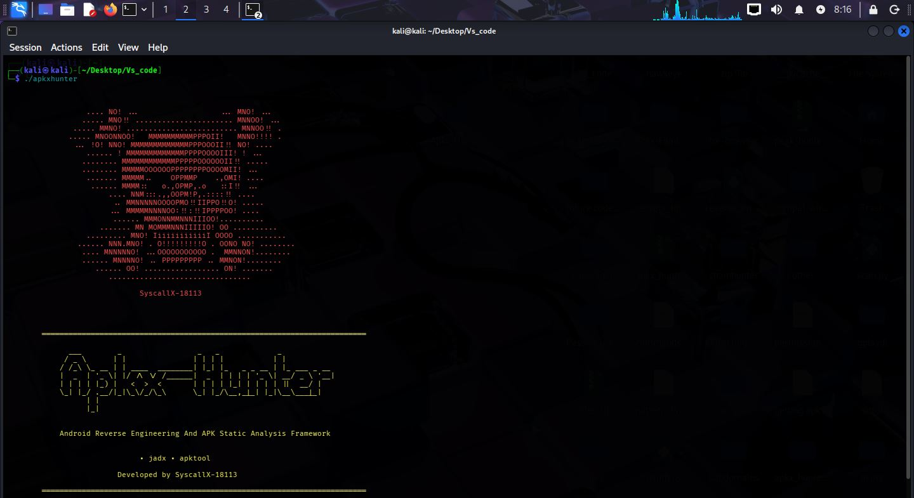

# APKXHunter              [](https://ko-fi.com/S2Y5230RHH)


**APKXHunter** is an Android Static Analysis Framework written entirely in **C**, purpose-built for Android security assessments, reverse engineering, bug bounty hunting, malware analysis, and penetration testing.

It combines multiple static analysis techniques — decompilation, secret detection, endpoint discovery, permission analysis, and native library detection — to uncover sensitive information inside Android applications, while producing clean, organized reports for security researchers.

APKXHunter also integrates a lightweight **Machine Learning-based Secret Classification Engine**, written entirely in C, which automatically classifies detected secrets by confidence and severity, helping researchers prioritize findings instead of manually reviewing every result.

- 🔗 **GitHub:** https://github.com/SyscallX-18113/Apkx-Hunter
- 👤 **Developed by:** SyscallX-18113
- 🏷️ **Version:** v1.0.0

---


---

## ✨ Features

- 🔍 **JADX Decompilation** — Fast and deep decompilation modes
- 🛠️ **APKTool Decompilation** — Full APKTool-based decompilation and scanning
- 📦 **Archive Extraction** — Support for APK, AAB, APKM, APKS, XAPK, and ZIP formats
- 📁 **Decompiled Folder Scanning** — Scan any already-decompiled JADX source directory
- 📁 **APKTool Folder Scanning** — Scan any already-decompiled APKTool directory
- 🔑 **Secret Detection** — Discover API keys, tokens, passwords, and embedded secrets
- 🌐 **Endpoint Discovery** — Identify URLs, endpoints, and security-relevant patterns
- 🔐 **Android Permission Analysis** — Analyze permissions and exported activities
- 📚 **Native (.so) Library Detection** — Detect native libraries bundled in the app
- 🗂️ **File Inventory Generation** — Generate a complete file inventory report
- 🤖 **Machine Learning-based Secret Classification** *(Highlighted Feature)* — ML-assisted confidence scoring for detected secrets to accelerate triage and reducing false positive in secrets finding
- 📡 **Offline ML Inference** — All model inference runs locally, with no cloud APIs or internet connection required
- 📊 **Confidence Probability Scoring** — Each detected secret receives a confidence probability from the trained model
- 🧮 **Feature Extraction Engine** — Extracts statistical features (entropy, character distribution, length, case ratios, digits, symbols) from every detected secret

---

Project Statistics

- Language: C
- Codebase: 3,300+ lines
- Architecture: Modular
- Platform: Linux

---

## Platform Support

- ✅ Linux (Supported)
- ❌ Windows (Not Supported)
- ❌ macOS (Not Supported)

---

## Performance

The following results are based on testing performed during development.

| Metric | Tested Value |
|---------|-------------:|
| Operating System | Kali Linux |
| RAM Used for Testing | 8 GB |
| CPU | Intel Core i3-2120 |
| Largest APK Successfully Decompiled or Scanned| 85 MB |
| Average Decompilation Time | ~50 - 60 seconds |

---

## System Requirements

Minimum:
- Linux
- 4 GB RAM
- JADX
- APKTool
- unzip

Recommended:
- Linux
- 8 GB RAM or higher
- Quad-core CPU
- SSD storage

---

## ⚙️ Installation

APKXHunter ships with an automated installer that checks for and installs only the dependencies that are missing on your system.

```bash
git https://github.com/SyscallX-18113/Apkx-Hunter.git
cd Apkx-Hunter
cd Apkx-Hunter
chmod +x install.sh
./install.sh
```

`install.sh` automatically checks for and installs required dependencies — it will **not** reinstall anything already present on your system.

---

## 🚀 Usage

```
USAGE
  ./apkxhunter <package/folder> [options] [options]
```

### General Options

| Flag | Description |
|------|-------------|
| `-h` | Show help message. |

---

## 🎯 Scan Modes

### Scanning Modes for JADX

| Flag | Description |
|------|-------------|
| `--fast` | Perform a fast jadx decompilation and scan extracted folder. |
| `--deep` | Perform a complete deep jadx decompilation and scan extracted folder. |

> **Note:** Use these flags only after giving apk file name

**Examples:**
```bash
./apkxhunter app.apk --fast
./apkxhunter app.apk --deep
```

### Scanning Modes for APKTool

| Flag | Description |
|------|-------------|
| `--apktool` | Perform a apktool decompilation and scan extracted folder. |

> **Note:** Use these flags only after giving apkfile name

**Examples:**
```bash
./apkxhunter app.apk --apktool
```

---

## 📁 Folder Scan

| Flag | Description |
|------|-------------|
| `--folder-scan` | Scan an already decompiled JADX source directory or any directory |
| `--apktool-folder-scan` | Scan an already decompiled Apktool directory — use this flag only for scanning decompiled apk folder which is decompiled by APKTOOL. |

> **Note:** Use these flags only after folder_name for scan

**Examples:**
```bash
./apkxhunter <folder_name> --folder-scan
./apkxhunter <folder_name_decompiled_by_apktool> --apktool-folder-scan
./apkxhunter <folder_name> --folder-scan --secrets
./apkxhunter <folder_name> --folder-scan --permissions
./apkxhunter <folder_name_decompiled_by_apktool> --apktool-folder-scan --secrets
./apkxhunter <folder_name_decompiled_by_apktool> --apktool-folder-scan --files
```

---

## 🧩 Individual Scanners

| Flag | Description |
|------|-------------|
| `--secrets` | Scan for API keys, tokens, passwords, and other embedded secrets. |
| `--permissions` | Analyze Android permissions or exported activity. |
| `--endpoints` | Discover URLs, endpoints, and patterns. |
| `--files` | Generate a file inventory report with .so name files extraction. |

> **Note:** Use these flags only after scanning modes flags or folder analysis flags

**Examples:**
```bash
./apkxhunter app.apk --deep --secrets
./apkxhunter app.apk --deep --permissions
./apkxhunter app.apk --deep --endpoints
./apkxhunter <folder_name> --folder-scan --secrets
./apkxhunter <folder_name> --folder-scan --permissions
./apkxhunter <folder_name_decompiled_by_apktool> --apktool-folder-scan --endpoints
./apkxhunter app.apk --deep --files
```

---

## 📄 Decompilation Only

| Flag | Description |
|------|-------------|
| `--decompile` | Decompile APK using JADX or APKTOOL — doesn't run folder scan after decompilation |

> **Note:** Use these flags only after scanning modes flags

**Examples:**
```bash
./apkxhunter app.apk --deep --decompile
./apkxhunter app.apk --fast --decompile
./apkxhunter app.apk --apktool --decompile
```

---

## 📦 Archive Extraction

| Flag | Description |
|------|-------------|
| `--extract` | Extract supported Android packages before analysis and save extracted apk to folder `extracted_output_<apk_name>`. |

**Supported Formats:** APK, AAB, APKM, APKS, XAPK, ZIP

**Example:**
```bash
./apkxhunter app.apkm --extract
```

---

## 🤖 ML Secret Classification

APKXHunter integrates a lightweight **Machine Learning-based Secret Classification Engine**, written entirely in C, as part of its secret detection workflow. This is a statistical Machine Learning model — not a Large Language Model, ChatGPT, Generative AI, or Deep Learning system.

- Secrets detected by APKXHunter are analyzed by the integrated Machine Learning classification engine.
- The model estimates the probability that a detected secret is valid or security-sensitive.
- Findings are prioritized using confidence-based severity scoring.
- The ML engine assists researchers in triaging findings faster.
- The ML engine is designed to assist human analysis rather than replace manual verification.

### ⚙️ How It Works

1. Detect potential secret.
2. Extract statistical features (entropy, character distribution, length, uppercase/lowercase ratios, digits, symbols, and other statistical token characteristics).
3. Load trained model (`model.bin`).
4. Perform ML inference.
5. Produce a confidence probability.
6. Present results to the user for manual verification.

### 🔒 Security Note

All Machine Learning inference is performed **locally** on the trained `model.bin` file. APKXHunter does not transmit scanned data, detected secrets, or any other analysis output externally — no cloud APIs are used, and no internet connection is required for ML inference.

---

## 🗃️ Output Directories

### JADX Analysis

```
Jadx_output_<apk_name>/
```

**Findings Reports:**
```
Result_Jadx_output_<apk_name>/
  |- secrets_findings.txt        -> Embedded API keys, tokens, secrets
  |- permissions.txt             -> Android permission analysis
  |- pattern_findings.txt        -> URLs, endpoints and security patterns
  |- files.txt                   -> File inventory report
  |- native_library_files.txt    -> Detected native (.so) libraries
```

### Folder Scan Result

**Findings Reports:**
```
Folder-scan_Result_<folder_name>/
  |- secrets_findings.txt
  |- permissions.txt
  |- pattern_findings.txt
  |- files.txt
  |- native_library_files.txt
```

### APKTool Analysis

```
Apktool_output_<apk_name>/
```

**Findings Reports:**
```
Apktool_Result_<apk_name>/
  |- secrets_findings.txt
  |- permissions.txt
  |- endpoint_findings.txt
  |- files.txt
  |- native_library_files.txt
```

### APKTOOL Folder Scan Result

**Findings Reports:**
```
Apktool-folder-scan_Result_<folder_name>/
  |- secrets_findings.txt
  |- permissions.txt
  |- endpoint_findings.txt
  |- files.txt
  |- native_library_files.txt
```

### Archive Extraction

```
extracted_output_<package_name>/
  |- Extracted APK files
```

---

## 📑 Report Files

| File | Description |
|------|-------------|
| `secrets_findings.txt` | Embedded API keys, tokens, secrets |
| `permissions.txt` | Android permission analysis |
| `pattern_findings.txt` | URLs, endpoints and security patterns (JADX / Folder Scan output) |
| `endpoint_findings.txt` | URLs, endpoints and security patterns (APKTool output) |
| `files.txt` | File inventory report |
| `native_library_files.txt` | Detected native (.so) libraries |

---

## 📦 Supported Formats

APK, AAB, APKM, APKS, XAPK, ZIP

---

## 📋 Requirements

APKXHunter depends on the following external tools:

- **JADX**
- **APKTool**
- **unzip**

`install.sh` automatically checks for these dependencies and installs only the ones that are missing — existing installations are left untouched.

---

## 💡 Example Commands

```bash
./apkxhunter app.apk --fast
./apkxhunter app.apk --deep
./apkxhunter app.apk --apktool
./apkxhunter <folder_name> --folder-scan
./apkxhunter <folder_name_decompiled_by_apktool> --apktool-folder-scan
./apkxhunter <folder_name> --folder-scan --secrets
./apkxhunter <folder_name> --folder-scan --permissions
./apkxhunter <folder_name_decompiled_by_apktool> --apktool-folder-scan --secrets
./apkxhunter <folder_name_decompiled_by_apktool> --apktool-folder-scan --files
./apkxhunter app.apk --deep --secrets
./apkxhunter app.apk --deep --permissions
./apkxhunter app.apk --deep --endpoints
./apkxhunter <folder_name_decompiled_by_apktool> --apktool-folder-scan --endpoints
./apkxhunter app.apk --deep --files
./apkxhunter app.apk --deep --decompile
./apkxhunter app.apk --fast --decompile
./apkxhunter app.apk --apktool --decompile
./apkxhunter app.apkm --extract
```

## 🚀 Next Update

APKX-Hunter v2.0 is planned to include **OWASP MASVS static security scanning**, bringing advanced Android security checks such as weak cryptography detection, certificate pinning analysis, root detection identification, insecure WebView detection, and an enhanced `advanced_findings.txt` report.

---

## ⚠️ Disclaimer

APKXHunter is intended strictly for:

- Educational purposes
- Authorized penetration testing
- Defensive security research

Users are solely responsible for ensuring they have proper authorization before analyzing any application. Unauthorized use of this tool against applications or systems you do not own or have explicit permission to test may be illegal.
