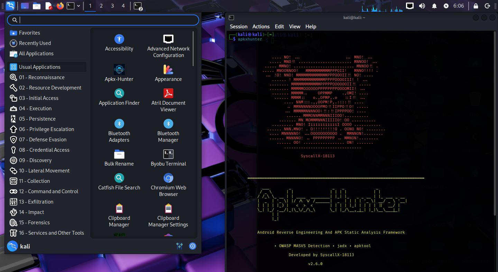
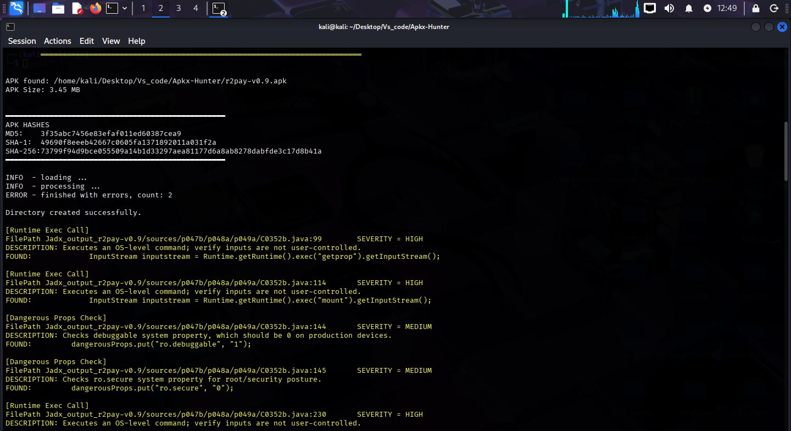

# APKX-Hunter v2.7.1 — Debian Package             [](https://ko-fi.com/S2Y5230RHH)   [](https://trendshift.io/repositories/79601?utm_source=trendshift-badge&utm_medium=badge&utm_campaign=badge-trendshift-79601)


**APKX-Hunter** is an open-source **Android Static Analysis Framework** written entirely in **C**, purpose-built for Android security assessments, reverse engineering, malware analysis, **OWASP MASVS** compliance scanning, bug bounty hunting, and penetration testing.

The framework supports both single-application and large-scale Android application analysis by automatically extracting and analyzing supported Android package formats, including **APK, APKS, APKM, XAPK, and ZIP** archives. With **Recursive Multi-APK Scanning** and **Silent Batch Mode**, APKX-Hunter is designed to efficiently process large Android application collections while producing clean, organized, and actionable results.

APKX-Hunter combines multiple static analysis techniques—including decompilation, AndroidManifest analysis, permission analysis, exported component detection, endpoint discovery, hardcoded secret detection, cloud configuration discovery, native library detection, and **OWASP MASVS** security checks—to uncover security-relevant information inside Android applications.

APKX-Hunter also integrates a lightweight **Machine Learning-based Secret Classification Engine**, written entirely in **C**, which automatically classifies detected secrets by confidence and severity helping security researchers prioritize high-value findings, reduce false positives, and accelerate vulnerability triage.

At the end of every scan, APKX-Hunter generates detailed scan statistics, including the number of APKs scanned, files analyzed, secrets detected, patterns detected, and MASVS findings, providing researchers with a comprehensive overview of the entire security assessment.

- **GitHub:** https://github.com/SyscallX-18113/Apkx-Hunter
- **Developed by:** SyscallX-18113
- **Version:** v2.7.1

---


---

## OWASP MASVS Scanning Support

Apkx-Hunter now includes **OWASP MASVS** security scanning with **15 categories** and **166 detection patterns**:

| # | Category | Patterns |
| :--- | :--- | :--- |
| 1 | Weak Cryptography | 28 |
| 2 | Certificate Pinning | 13 |
| 3 | Root Detection | 20 |
| 4 | Anti Debugging | 9 |
| 5 | Anti Tamper | 3 |
| 6 | SharedPreferences | 8 |
| 7 | SQLite | 9 |
| 8 | External Storage | 11 |
| 9 | Dynamic Code Loading | 10 |
| 10 | Reflection | 9 |
| 11 | Runtime Command Execution | 9 |
| 12 | WebView Security | 13 |
| 13 | Network Security | 10 |
| 14 | SSL Validation | 10 |
| 15 | Native Library Loading | 9 |
| | **TOTAL** | **166** |

### OWASP Validation
APKXHunter has been tested against the OWASP UnCrackable Level 4 application. The scan successfully identified multiple security findings, demonstrating the effectiveness of its OWASP MASVS scanning engine and Android static analysis capabilities.



---

## Features

- **Linux & Debian Integration** — Native Debian package (.deb), System-wide installation, Desktop application launcher, Application menu integration, Custom application icon, Automatic framework asset installation, Built-in dependency manager (--install-dependencies)
- **OWASP MASVS Support** — Apkx-Hunter now includes comprehensive **OWASP MASVS** security scanning with **14+ categories** and **160+ detection patterns**: 
- **JADX Decompilation** — Fast and deep decompilation modes
- **APKTool Decompilation** — Full APKTool-based decompilation and scanning
- **Archive Extraction** — Support for APK, APKM, APKS, XAPK, and ZIP formats
- **Decompiled Folder Scanning** — Scan any already-decompiled JADX source directory
- **APKTool Folder Scanning** — Scan any already-decompiled APKTool directory
- **Secret Detection** — Discover API keys, tokens, passwords, and embedded secrets
- **Endpoint Discovery** — Identify URLs, endpoints, and security-relevant patterns
- **Android Permission Analysis** — Analyze permissions and exported activities
- **Native (.so) Library Detection** — Detect native libraries bundled in the app
- **File Inventory Generation** — Generate a complete file inventory report
- **Machine Learning-based Secret Classification** *(Highlighted Feature)* — ML-assisted confidence scoring for detected secrets to accelerate triage and reducing false positive in secrets finding
- **Recursive Multi-APK Scanning** — Automatically scan multiple APKs recursively for large-scale Android application analysis
- **Automatic Package Extraction** — Automatically extract and analyze APKs from **APKS, APKM, XAPK, and ZIP** package formats
- **Silent Batch Mode** — Cleaner terminal output during large-scale scans while preserving analysis results
- **End-of-Scan Statistics** — Display detailed scan summary including APKs scanned, files analyzed, secrets detected, patterns detected, and MASVS findings
- **Enhanced Command-Line Interface** — Improved argument parsing, input validation, and user-friendly error reporting
- **Improved Framework Stability** — Enhanced error handling, memory management, and overall framework reliability

Machine Learning Model
APKXHunter uses an offline machine learning classifier. `model.bin` contains only trained numerical weights used to calculate the confidence score of detected secrets.
It is NOT executable.
It contains no code.
It is loaded as binary data only.

- **Offline ML Inference** — All model inference runs locally, with no cloud APIs or internet connection required
- **Confidence Probability Scoring** — Each detected secret receives a confidence probability from the trained model

---

Project Statistics

- Language: C
- Codebase: 5,800+ lines
- Architecture: Modular
- Platform: Linux

---

## Platform Support

- Linux (Supported)
- Windows (Not Supported)
- macOS (Not Supported)

---

## Performance

The following results are based on testing performed during development.

| Metric | Tested Value |
|---------|-------------:|
| Operating System | Kali Linux |
| RAM Used for Testing | 8 GB |
| CPU | Intel Core i3-2120 |
| Largest APK Successfully Decompiled or Scanned| 85 MB |
| Average Decompilation Time | ~50 - 60 seconds |

---

## System Requirements

Minimum:
- Linux
- 4 GB RAM
- JADX
- APKTool
- unzip

Recommended:
- Linux
- 8 GB RAM or higher
- Quad-core CPU
- SSD storage

---

## ML Secret Classification

APKXHunter integrates a lightweight **Machine Learning-based Secret Classification Engine**, written entirely in C, as part of its secret detection workflow. This is a statistical Machine Learning model — not a Large Language Model, ChatGPT, Generative AI, or Deep Learning system.

- Secrets detected by APKXHunter are analyzed by the integrated Machine Learning classification engine.
- The model estimates the probability that a detected secret is valid or security-sensitive.
- Findings are prioritized using confidence-based severity scoring.
- The ML engine assists researchers in triaging findings faster.
- The ML engine is designed to assist human analysis rather than replace manual verification.

### How It Works

1. Detect potential secret.
2. Extract statistical features (entropy, character distribution, length, uppercase/lowercase ratios, digits, symbols, and other statistical token characteristics).
3. Load trained model (`model.bin`).
4. Perform ML inference.
5. Produce a confidence probability.
6. Present results to the user for manual verification.

### Security Note

All Machine Learning inference is performed **locally** on the trained `model.bin` file. APKXHunter does not transmit scanned data, detected secrets, or any other analysis output externally — no cloud APIs are used, and no internet connection is required for ML inference.

---

## Installation

### Debian / Kali / Ubuntu

Install the Debian package:

```bash
sudo dpkg -i apkx-hunter_2.7.1-1_amd64.deb
```

Dependency Management:  Automatically check and install JADX, Apktool, Java, and other required tools.
```bash
--install-dependencies 
```

---

## Usage

```
USAGE
apkxhunter <package/folder> [options] [options]
```

### General Options

| Flag | Description |
|------|-------------|
| `--help` | Show help message. |

---

## Scan Modes

### Scanning Modes for JADX

| Flag | Description |
|------|-------------|
| `--fast` | Perform a fast jadx decompilation and scan extracted folder. |
| `--deep` | Perform a complete deep jadx decompilation and scan extracted folder. |

> **Note:** Use these flags only after giving apk file name

**Examples:**
```bash
apkxhunter app.apk --fast
apkxhunter app.apk --deep
```

### Scanning Modes for APKTool

| Flag | Description |
|------|-------------|
| `--apktool` | Perform a apktool decompilation and scan extracted folder. |

> **Note:** Use these flags only after giving apkfile name

**Examples:**
```bash
apkxhunter app.apk --apktool
```
## MULTI APK SCANNING MODE FROM FOLDER

| Flag | Description |
|------|-------------|
| `--multi-apk` | Perform a multi apk decompilation and scan extracted folder. |

> **Note:** Use these flags only after giving apk_files_folder name                                                                                                                                            
**Examples:**
```
apkxhunter Apks --multi-apk
```

## APK PACKAGE SCANNNING MODE:  

| Flag | Description |
|------|-------------|
| `--extract-multi-apk` | Extract package (APKS/APKM/XAPK/ZIP) and automatically analyze every extracted APK. |
                                                                                                   
> **Note:** Use these flags only after giving apk_package_file name

**Examples:**
```
apkxhunter test.apkm --extract-multi-apk
```

## Folder Scan

| Flag | Description |
|------|-------------|
| `--folder-scan` | Scan an already decompiled JADX source directory or any directory |
| `--apktool-folder-scan` | Scan an already decompiled Apktool directory — use this flag only for scanning decompiled apk folder which is decompiled by APKTOOL. |

> **Note:** Use these flags only after folder_name for scan

**Examples:**
```bash
apkxhunter <folder_name> --folder-scan
apkxhunter <folder_name_decompiled_by_apktool> --apktool-folder-scan
apkxhunter <folder_name> --folder-scan --secrets
apkxhunter <folder_name> --folder-scan --masvs 
apkxhunter <folder_name> --folder-scan --permissions
apkxhunter <folder_name_decompiled_by_apktool> --apktool-folder-scan --secrets
apkxhunter <folder_name_decompiled_by_apktool> --apktool-folder-scan --files
```

---

## Individual Scanners

| Flag | Description |
|------|-------------|
| `--secrets` | Scan for API keys, tokens, passwords, and other embedded secrets. |
| `--permissions` | Analyze Android permissions or exported activity. |
| `--endpoints` | Discover URLs, endpoints, and patterns. |
| `--files` | Generate a file inventory report with .so name files extraction. |
| `--masvs` | OWASP MASVS Scan. |

> **Note:** Use these flags only after scanning modes flags or folder analysis flags

**Examples:**
```bash
apkxhunter app.apk --deep --secrets
apkxhunter Apks_folder --deep --multi-apk --secrets
apkxhunter test.apkm --extract-multi-apk --secrets
apkxhunter app.apk --deep --masvs
apkxhunter <folder_name> --folder-scan --secrets
apkxhunter <folder_name> --folder-scan --permissions
apkxhunter <folder_name_decompiled_by_apktool> --apktool-folder-scan --endpoints
apkxhunter app.apk --deep --files
```

---

## Decompilation Only

| Flag | Description |
|------|-------------|
| `--decompile` | Decompile APK using JADX or APKTOOL — doesn't run folder scan after decompilation |

> **Note:** Use these flags only after scanning modes flags

**Examples:**
```bash
apkxhunter app.apk --deep --decompile
apkxhunter app.apk --fast --decompile
apkxhunter app.apk --apktool --decompile
```

---

## Archive Extraction

| Flag | Description |
|------|-------------|
| `--extract` | Extract supported Android packages before analysis and save extracted apk to folder `extracted_output_<apk_name>`. |

**Supported Formats:** APK, APKM, APKS, XAPK, ZIP

**Example:**
```bash
apkxhunter app.apkm --extract
```

---

## Output Directories

### JADX Analysis

```
Jadx_output_<apk_name>/
```

**Findings Reports:**
```
Result_Jadx_output_<apk_name>/
  |- secrets_findings.txt        -> Embedded API keys, tokens, secrets
  |- permissions.txt             -> Android permission analysis
  |- pattern_findings.txt        -> URLs, endpoints and security patterns
  |- files.txt                   -> File inventory report
  |- native_library_files.txt    -> Detected native (.so) libraries
  |- masvs_findings.txt          -> OWASP MASVS Scann Result
```

### Folder Scan Result

**Findings Reports:**
```
Folder-scan_Result_<folder_name>/
  |- secrets_findings.txt
  |- permissions.txt
  |- pattern_findings.txt
  |- files.txt
  |- native_library_files.txt
  |- masvs_findings.txt     
```

### APKTool Analysis

```
Apktool_output_<apk_name>/
```

**Findings Reports:**
```
Apktool_Result_<apk_name>/
  |- secrets_findings.txt
  |- permissions.txt
  |- endpoint_findings.txt
  |- files.txt
  |- native_library_files.txt
  |- masvs_findings.txt      
```

### APKTOOL Folder Scan Result

**Findings Reports:**
```
Apktool-folder-scan_Result_<folder_name>/
  |- secrets_findings.txt
  |- permissions.txt
  |- endpoint_findings.txt
  |- files.txt
  |- native_library_files.txt
  |- masvs_findings.txt       
```

### Archive Extraction

```
extracted_output_<package_name>/
  |- Extracted APK files
```

---

## Report Files

| File | Description |
|------|-------------|
| `secrets_findings.txt` | Embedded API keys, tokens, secrets |
| `permissions.txt` | Android permission analysis |
| `pattern_findings.txt` | URLs, endpoints and security patterns (JADX / Folder Scan output) |
| `endpoint_findings.txt` | URLs, endpoints and security patterns (APKTool output) |
| `files.txt` | File inventory report |
| `native_library_files.txt` | Detected native (.so) libraries |
| `masvs_findings.txt` | OWASP MASVS Scann Result |

---

## Supported Formats

APK, APKM, APKS, XAPK, ZIP

---

## Upcoming Features 

Next Update will focus on making security findings **more accurate, organized, actionable, and easier to analyze**, while significantly reducing unnecessary false positives.

### Improved Finding Analysis

* Separate MASVS analysis by security category.
* Improved organization of MASVS findings.
* More precise MASVS detection rules.
* Better evidence associated with each MASVS finding.
* Improved severity classification.
* Clear **Critical / High / Medium** severity levels.
* Grouped findings by security category.
* Per-file and per-line evidence.
* Reduced false positives for common non-secret strings.
* Better prioritization of high-confidence secrets.
* Improved scalability for large APKs.
* Better handling of large projects containing tens of thousands of files.
* Additional error handling and validation.
* New security detection patterns.

---

## Feedback & Support

APKXHunter is an actively maintained open-source project.

If you:

- Found a bug
- Have a feature request
- Want to suggest improvements
- Found a security issue
- Have documentation suggestions

Please open a GitHub Issue or contact me directly:

syscallx18113@gmail.com

Your feedback helps improve APKXHunter for everyone.

---

## Development & Contributions
APKX-Hunter is currently maintained solely by its author. External code contributions are not being accepted at this time. Suggestions, bug reports, and security-related feedback are still welcome.

---

## Disclaimer

APKXHunter is intended strictly for:

- Educational purposes
- Authorized penetration testing
- Defensive security research

Users are solely responsible for ensuring they have proper authorization before analyzing any application. Unauthorized use of this tool against applications or systems you do not own or have explicit permission to test may be illegal.

## License

APKXHunter is licensed under the Apache License 2.0.

Copyright © 2026 Devesh Kachhawaha (SyscallX-18113).
