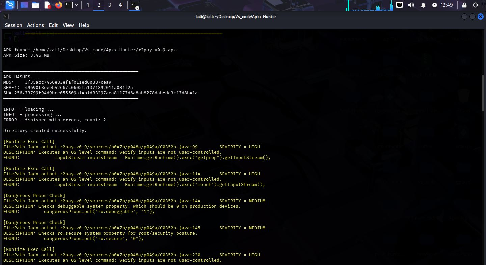

# APKX-Hunter v3.0.0 -- Debian Package           [](https://ko-fi.com/S2Y5230RHH)   

## **APKX-Hunter at Black Hat Arsenal Europe 2026**

[View APKX-Hunter on Black Hat Europe Arsenal](https://blackhat.com/europe/arsenal/schedule/#apkxhunter-advanced-android-static-analysis-framework-56751)


**APKX-Hunter** is an open-source **Android Static Analysis Framework** written entirely in **C**, purpose-built for Android security assessments, reverse engineering, malware analysis, **OWASP MASVS** compliance scanning, bug bounty hunting, Apk Testing, and penetration testing.

The framework supports both single-application and large-scale Android application analysis by automatically extracting and analyzing supported Android package formats, including **APK, APKS, APKM, XAPK, and ZIP** archives. With **Recursive Multi-APK Scanning**, **Silent Batch Mode**, and organized scan output, APKX-Hunter is designed to efficiently process individual applications as well as large Android application collections while producing clean, structured, and actionable results.

APKX-Hunter combines multiple static analysis techniques—including decompilation, AndroidManifest analysis, permission analysis, exported component detection, endpoint discovery, hardcoded secret detection, cloud configuration discovery, native library detection, and **OWASP MASVS** security checks—to uncover security-relevant information inside Android applications.

APKX-Hunter also provides an integrated interactive **command-line shell**, giving researchers a dedicated framework interface for running analysis operations, configuring scan modes, navigating project workflows, and interacting with APKX-Hunter directly from the terminal. Shell features include command history, interactive command handling, scan controls, and framework-level commands designed to make repeated analysis workflows faster and more efficient.

The framework includes a **Code Search and Investigation Engine** for analyzing decompiled and extracted application source code. Researchers can recursively search project directories for specific code patterns or strings This makes it easier to investigate suspicious implementations, trace security-sensitive functionality, identify vulnerable patterns, and quickly navigate large decompiled codebases.

APKX-Hunter also integrates a lightweight **Machine Learning-based Secret Classification Engine**, written entirely in **C**, which automatically classifies detected secrets by confidence and severity. This helps reduce false positives, and accelerate vulnerability triage.

The framework generates **organized and structured output files** throughout the analysis process, separating relevant findings and security results into clear categories for easier investigation, reporting, and further analysis. At the end of every scan, APKX-Hunter generates detailed **scan statistics**, including the number of APKs scanned, files analyzed, secrets detected, patterns detected, and MASVS findings, providing researchers with a comprehensive overview of the entire security assessment.


**APKX-Hunter is designed as a complete Android static analysis workflow—from application extraction and automated discovery to manual code investigation and security triage.**


- **GitHub:** https://github.com/SyscallX-18113/Apkx-Hunter
- **Developed by:** SyscallX-18113
- **Version:** v3.0.0

---


---

## OWASP MASVS Scanning Support

Apkx-Hunter now includes **OWASP MASVS** security scanning with **15 categories** and **100 detection patterns**:

| # | Category | Patterns |
| :--- | :--- | :--- |
| 1 | Weak Cryptography | 18 |
| 2 | Certificate Pinning | 6 |
| 3 | Root Detection | 7 |
| 4 | Anti Debugging | 6 |
| 5 | Anti Tamper | 4 |
| 6 | SharedPreferences | 9 |
| 7 | SQLite | 3 |
| 8 | External Storage | 5 |
| 9 | Dynamic Code Loading | 3 |
| 10 | Reflection | 2 |
| 11 | Runtime Command Execution | 4 |
| 12 | WebView Security | 14 |
| 13 | Network Security | 10 |
| 14 | SSL Validation | 5 |
| 15 | Native Library Loading | 4 |
| | **TOTAL** | **100** |

### OWASP Validation
APKXHunter has been tested against the OWASP UnCrackable Level 4 application. The scan successfully identified multiple security findings, demonstrating the effectiveness of its OWASP MASVS scanning engine and Android static analysis capabilities.



---

## Features

- **OWASP MASVS Support** — Apkx-Hunter now includes comprehensive **OWASP MASVS** security scanning with **14+ categories** and **100 detection patterns**: 
- **JADX Decompilation** — Fast and deep decompilation modes
- **APKTool Decompilation** — Full APKTool-based decompilation and scanning
- **Archive Extraction** — Support for APK, APKM, APKS, XAPK, and ZIP formats
- **Decompiled Folder Scanning** — Scan any already-decompiled JADX source directory
- **APKTool Folder Scanning** — Scan any already-decompiled APKTool directory
- **Secret Detection** — Discover API keys, tokens, passwords, and embedded secrets
- **Endpoint Discovery** — Identify URLs, endpoints, and security-relevant patterns
- **Android Permission Analysis** — Analyze permissions and exported activities
- **Native (.so) Library Detection** — Detect native libraries bundled in the app
- **File Inventory Generation** — Generate a complete file inventory report
- **Machine Learning-based Secret Classification** *(Highlighted Feature)* — ML-assisted confidence scoring for detected secrets to accelerate triage and reducing false positive in secrets finding
- **Recursive Multi-APK Scanning** — Automatically scan multiple APKs recursively for large-scale Android application analysis
- **Automatic Package Extraction** — Automatically extract and analyze APKs from **APKS, APKM, XAPK, and ZIP** package formats
- **Silent Batch Mode** — Cleaner terminal output during large-scale scans while preserving analysis results
- **End-of-Scan Statistics** — Display detailed scan summary including APKs scanned, files analyzed, secrets detected, patterns detected, and MASVS findings
- **Enhanced Command-Line Interface** — Improved argument parsing, input validation, and user-friendly error reporting
- **Improved Framework Stability** — Enhanced error handling, memory management, and overall framework reliability
- **Shell Integration** — Added an integrated interactive framework shell with command history, scan controls, and framework-level commands
- **Code Search & Investigation** — Added recursive source-code searching with file paths, line numbers, matching lines, and surrounding code context
- **Categorized MASVS Findings** — Organized MASVS security findings into dedicated categories for easier analysis and reporting
- **No Output On Terminal Mode** - Prints no findings or output on terminal during scan.

Machine Learning Model
APKXHunter uses an offline machine learning classifier. `model.bin` contains only trained numerical weights used to calculate the confidence score of detected secrets.
It is NOT executable.
It contains no code.
It is loaded as binary data only.

- **Offline ML Inference** — All model inference runs locally, with no cloud APIs or internet connection required
- **Confidence Probability Scoring** — Each detected secret receives a confidence probability from the trained model

---

Project Statistics

- Language: C
- Codebase: 6,700+ lines
- Architecture: Modular
- Platform: Linux

---

## Platform Support

- Linux (Supported)
- Windows (Not Supported)
- macOS (Not Supported)

---

## Performance

The following results are based on testing performed during development.

| Metric | Tested Value |
|---------|-------------:|
| Operating System | Kali Linux |
| RAM Used for Testing | 8 GB |
| CPU | Intel Core i3-2120 |
| Largest APK Successfully Decompiled or Scanned| 85 MB |
| Average Decompilation Time | ~50 - 60 seconds |

---

## System Requirements

Minimum:
- Linux
- 4 GB RAM
- JADX
- APKTool
- unzip

Recommended:
- Linux
- 8 GB RAM or higher
- Quad-core CPU
- SSD storage

---

## ML Secret Classification

APKXHunter integrates a lightweight **Machine Learning-based Secret Classification Engine**, written entirely in C, as part of its secret detection workflow. This is a statistical Machine Learning model — not a Large Language Model, ChatGPT, Generative AI, or Deep Learning system.

- Secrets detected by APKXHunter are analyzed by the integrated Machine Learning classification engine.
- The model estimates the probability that a detected secret is valid or security-sensitive.
- Findings are prioritized using confidence-based severity scoring.
- The ML engine assists researchers in triaging findings faster.
- The ML engine is designed to assist human analysis rather than replace manual verification.

### How It Works

1. Detect potential secret.
2. Extract statistical features (entropy, character distribution, length, uppercase/lowercase ratios, digits, symbols, and other statistical token characteristics).
3. Load trained model (`model.bin`).
4. Perform ML inference.
5. Produce a confidence probability.
6. Present results to the user for manual verification.

### Security Note

All Machine Learning inference is performed **locally** on the trained `model.bin` file. APKXHunter does not transmit scanned data, detected secrets, or any other analysis output externally — no cloud APIs are used, and no internet connection is required for ML inference.

### Shell Commands

| Command | Usage |
|---|---|
| `help` | Display available commands |
| `run` | Execute APKX-Hunter analysis |
| `clear` | Clear the terminal |
| `banner` | Display the APKX-Hunter banner |
| `exit` | Exit the framework |
| `run search <folder> <string>` | Search and investigate code recursively |
| `run <apk_file/folder> [options]` | Run Analysis Scan |

---

## Installation

### Debian / Kali / Ubuntu

Install the Debian package:

```bash
sudo dpkg -i apkx-hunter_3.0.0-1_amd64.deb
```

Dependency Management:  Automatically check and install JADX, Apktool, Java, and other required tools.
```bash
run install-dependencies 
```

---

## Usage

```
USAGE
run <package/folder> [options] [options]
```

### General Options

| Flag | Description |
|------|-------------|
| `help` | Show help message. |

---

## Scan Modes

### Scanning Modes for JADX

| Flag | Description |
|------|-------------|
| `fast` | Perform a fast jadx decompilation and scan extracted folder. |
| `deep` | Perform a complete deep jadx decompilation and scan extracted folder. |

> **Note:** Use these flags only after giving apk file name

**Examples:**
```bash
run app.apk fast
```

### Scanning Modes for APKTool

| Flag | Description |
|------|-------------|
| `apktool` | Perform a apktool decompilation and scan extracted folder. |

> **Note:** Use these flags only after giving apkfile name

**Examples:**
```bash
run app.apk apktool
```
## MULTI APK SCANNING MODE FROM FOLDER

| Flag | Description |
|------|-------------|
| `multi-apk` | Perform a multi apk decompilation and scan extracted folder. |

> **Note:** Use these flags only after giving apk_files_folder name                                                                                                                                            
**Examples:**
```
run Apks multi-apk
```

## APK PACKAGE SCANNNING MODE:  

| Flag | Description |
|------|-------------|
| `extract-multi-apk` | Extract package (APKS/APKM/XAPK/ZIP) and automatically analyze every extracted APK. |
                                                                                                   
> **Note:** Use these flags only after giving apk_package_file name

**Examples:**
```
run test.apkm extract-multi-apk
```

## Folder Scan

| Flag | Description |
|------|-------------|
| `folder-scan` | Scan an already decompiled JADX source directory or any directory |
| `apktool-folder-scan` | Scan an already decompiled Apktool directory — use this flag only for scanning decompiled apk folder which is decompiled by APKTOOL. |

> **Note:** Use these flags only after folder_name for scan

**Examples:**
```bash
apkxhunter <folder_name> folder-scan
apkxhunter <folder_name_decompiled_by_apktool> apktool-folder-scan
apkxhunter <folder_name> folder-scan secrets
apkxhunter <folder_name> folder-scan masvs 
apkxhunter <folder_name> folder-scan permissions
apkxhunter <folder_name_decompiled_by_apktool> apktool-folder-scan secrets
apkxhunter <folder_name_decompiled_by_apktool> apktool-folder-scan files
```

---

## Individual Scanners

| Flag | Description |
|------|-------------|
| `secrets` | Scan for API keys, tokens, passwords, and other embedded secrets. |
| `permissions` | Analyze Android permissions or exported activity. |
| `endpoints` | Discover URLs, endpoints, and patterns. |
| `files` | Generate a file inventory report with .so name files extraction. |
| `masvs` | OWASP MASVS Scan. |

> **Note:** Use these flags only after scanning modes flags or folder analysis flags

**Examples:**
```bash
run app.apk deep secrets
run Apks_folder deep multi-apk secrets
run test.apkm extract-multi-apk secrets
run app.apk deep masvs
```

---

## CODE INVESTIGATION
| Flag | Description |
|------|-------------|
| `search` | Find given string in given decompiled or any folder in files or do Code Investigation |

**Examples:**
```bash
run search <Folder_name> <Search String>
```

---

## NO OUPUT ON TERMINAL MODE
| Flag | Description |
|------|-------------|
| `quiet` | Prints no findings or output on terminal. |
       
**Examples:**
```bash
run <apk> <options> quit\n"
```

---


## Decompilation Only

| Flag | Description |
|------|-------------|
| `decompile` | Decompile APK using JADX or APKTOOL — doesn't run folder scan after decompilation |

> **Note:** Use these flags only after scanning modes flags

**Examples:**
```bash
run app.apk deep decompile
run app.apk apktool decompile
```

---

## Archive Extraction

| Flag | Description |
|------|-------------|
| `extract` | Extract supported Android packages before analysis and save extracted apk to folder `extracted_output_<apk_name>`. |

**Supported Formats:** APK, APKM, APKS, XAPK, ZIP

**Example:**
```bash
run app.apkm extract
```

---

## OUTPUT DIRECTORY TYPES

### JADX Analysis:
```bash
Jadx_output_<apk_name>/
Findins Reports:
        Result_Jadx_output_<apk_name>/
```

### Folder Scan Result:
```bash
Findings Reports:
        Folder-Scan_Result_<folder_name>/
```

### APKTool Analysis:
```bash
Apktool_output_<apk_name>/
      Findings Reports:
           Apktool_Result_<apk_name>/
```

### APKTOOL Folder Scan Result:
```bash
Findings Reports:
      Apktool-folder-scan_Result_<folder_name>/
```

### Archive Extraction:
```bash
extracted_output_<package_name>/
```

## OUTPUT DIRECTORY STRUCTURE:
```bash
Findings
     |- secrets_findings.txt      -> Embedded API keys, tokens, secrets
     |- permissions_findings.txt  -> Android permission analysis
     |- pattern_findings.txt      -> URLs, endpoints and security patterns
     |- files.txt                 -> File inventory report
     |- native_library_files.txt  -> Detected native (.so) libraries
     masvs_findings/ 
     ├────crypto_network.txt
     │     ├── Weak Cryptography
     │     ├── Certificate Pinning
     │     ├── Network Security
     │     └── SSL Validation
     │  
     ├────platform_defense.txt
     │     ├── Root Detection
     │     ├── Anti Debugging
     │     └── Anti Tamper
     │
     ├────data_storage.txt
     │     ├── SharedPreferences
     │     ├── SQLite
     │     └── External Storage
     │  
     ├────code_execution.txt
     │     ├── Dynamic Code Loading
     │     ├── Reflection
     │     └── Runtime Command Execution
     │  
     └────web_native.txt
           ├── WebView Security
           └── Native Library Loading
           
```        

---

## Supported Formats

APK, APKM, APKS, XAPK, ZIP


---

## Feedback & Support

APKXHunter is an actively maintained open-source project.

If you:

- Found a bug
- Have a feature request
- Want to suggest improvements
- Found a security issue
- Have documentation suggestions

Please open a GitHub Issue or contact me directly:

syscallx18113@gmail.com

Your feedback helps improve APKXHunter for everyone.

---

## Development & Contributions
APKX-Hunter is currently maintained solely by its author. External code contributions are not being accepted at this time. Suggestions, bug reports, and security-related feedback are still welcome.

---

## Disclaimer

APKXHunter is intended strictly for:

- Educational purposes
- Authorized penetration testing
- Defensive security research

Users are solely responsible for ensuring they have proper authorization before analyzing any application. Unauthorized use of this tool against applications or systems you do not own or have explicit permission to test may be illegal.

## License

APKXHunter is licensed under the Apache License 2.0.

Copyright © 2026 Devesh Kachhawaha (SyscallX-18113).
